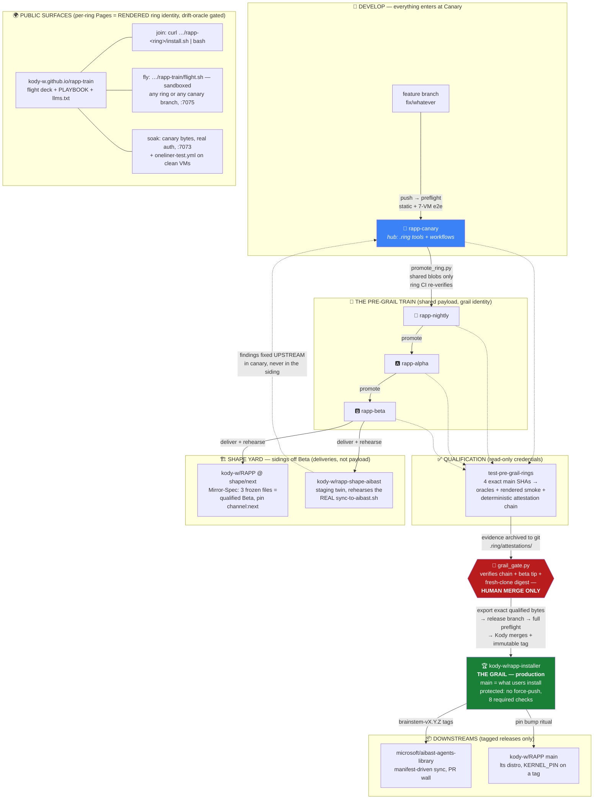

# 🚂 rapp-train — the RAPP release-train flight deck

**https://kody-w.github.io/rapp-train/** — every ring of the RAPP Brainstem
release train, joinable or sandbox-testable from any machine with one pasted
line. Feature branches on [rapp-canary](https://github.com/kody-w/rapp-canary)
appear automatically as individually flyable "flights".

- 📖 **[PLAYBOOK.md](https://kody-w.github.io/rapp-train/PLAYBOOK.md)** — every scenario, choose-your-own-adventure, for humans and AIs
- 🤖 **[llms.txt](https://kody-w.github.io/rapp-train/llms.txt)** — machine entry point
- 🛠 Operations: the hub **[RUNBOOK](https://github.com/kody-w/rapp-canary/blob/main/.ring/RUNBOOK.md)**

## Architecture

**The two laws the arrows encode:** every oracle going red (preflight, rewrite
drift, attestation chain, gate) is the system *working* — diagnose upstream,
never bypass; and nothing pushes to the Grail except a human's conscious
release act — the tooling is structurally incapable of it.

This repo is only the deck: the actual install endpoints are each ring repo's
own GitHub Pages (rendered ring identity — never the raw-URL copies, which
carry grail identity by design and install the wrong repo).
